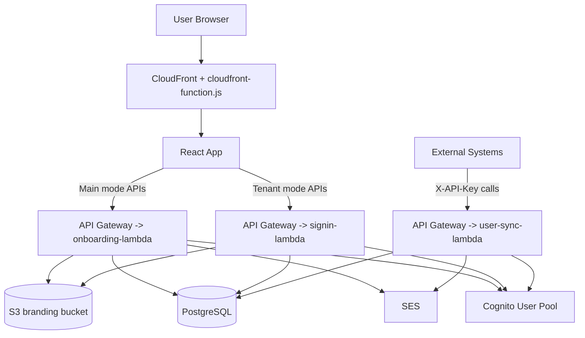
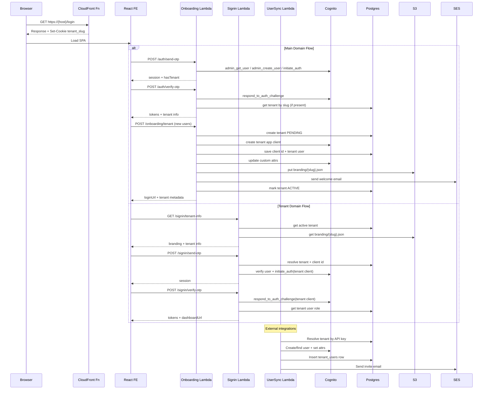

# TenantLambda End-to-End Flow

## 1. System Overview
TenantLambda is a multi-tenant onboarding and authentication system with 3 backend Lambdas and 1 React frontend:

- Main domain flow (signup/onboarding): `onboarding-lambda/handler.py`
- Tenant subdomain sign-in flow: `signin-lambda/handler.py`
- External user provisioning flow: `user-sync-lambda/handler.py`
- Frontend orchestrator UI: `TenantOnboardingFE/src/*`
- Edge slug injection: `cloudfront-function.js`

Core AWS dependencies:

- CloudFront Function: derives `tenant_slug` cookie from host
- API Gateway: routes HTTP endpoints to Lambdas
- Cognito User Pool: OTP auth + custom attributes (`custom:tenant_id`, `custom:role`)
- PostgreSQL: tenant metadata and tenant users
- S3: branding JSON (`branding/{slug}.json`)
- SES: welcome/invite emails

## 2. Runtime Mode Detection (Frontend)
Mode detection is done in `TenantOnboardingFE/src/config.js`:

1. Parse host subdomain from `window.location.hostname`
2. If present, override with `tenant_slug` cookie
3. `tenantSlug === 'default'` => main site mode
4. Otherwise => tenant mode

`TenantOnboardingFE/src/context/TenantContext.js` then:

- In main mode: no branding fetch
- In tenant mode: calls `GET /signin/tenant-info?slug=...`
- If tenant lookup fails: marks `isNotFound` and routes to not-found UI

## 3. High-Level End-to-End Diagram

## 4. Flow A: Main Domain Login + Onboarding
Used on default domain (`/login`, `/verify`, `/signup`).

### A1. Send OTP
- UI: `TenantOnboardingFE/src/pages/LoginPage.js`
- API: `POST /auth/send-otp` (`onboarding-lambda/handler.py` -> `handle_send_otp`)

Backend actions:

1. Validate email format
2. `admin_get_user` in Cognito
3. If user missing -> `admin_create_user` with `MessageAction='SUPPRESS'`
4. Read `custom:tenant_id` to detect whether user already has workspace
5. Trigger OTP via `initiate_auth(AuthFlow='USER_AUTH', PREFERRED_CHALLENGE='EMAIL_OTP')`
6. Return `session`, `hasTenant`, `tenantSlug`

### A2. Verify OTP
- UI: `TenantOnboardingFE/src/pages/VerifyOtpPage.js`
- API: `POST /auth/verify-otp` (`handle_verify_otp`)

Backend actions:

1. Validate `{email, otp, session}` and 8-digit OTP
2. Verify challenge with `respond_to_auth_challenge`
3. Read Cognito attributes (`custom:tenant_id`, `custom:role`)
4. If tenant exists -> fetch tenant row from PG via `onboarding-lambda/db.py:get_tenant_by_slug`
5. Return tokens + tenant metadata (`hasTenant`, `tenantName`, `loginUrl`)

Frontend branching:

- `hasTenant=true` -> `/welcome-back`
- `hasTenant=false` -> `/signup`

### A3. Slug Availability
- UI component: `TenantOnboardingFE/src/components/SlugChecker.js`
- API: `GET /onboarding/check-slug?slug=...`

Backend (`handle_check_slug` + `onboarding-lambda/db.py:is_slug_available`):

1. Validate slug length and regex
2. Check `reserved_slugs`
3. Check `tenants`
4. Return availability and reason (`RESERVED`/`TAKEN`)

### A4. Create Tenant (11-step transaction flow)
- UI: `TenantOnboardingFE/src/pages/SignupPage.js`
- API: `POST /onboarding/tenant` (`handle_create_tenant`)

Backend sequence:

1. Verify access token (`cognito.get_user`)
2. Reject if user already has `custom:tenant_id`
3. Validate `companyName`, `slug`, `plan`
4. Re-check slug availability
5. Insert tenant row in PG with `status='PENDING'` + generated API key
6. Create tenant-specific Cognito app client
7. Persist app client ID in PG
8. Set user Cognito attrs: `custom:tenant_id=<slug>`, `custom:role=tenant_admin`
9. Insert admin row into `tenant_users`
10. Upload default branding JSON to S3 (`branding/{slug}.json`)
11. Send welcome email via SES (non-fatal on failure)
12. Mark tenant `ACTIVE`

Compensation on error:

- If client created: delete Cognito client
- If tenant created: mark tenant `FAILED`

### A5. Completion
- UI: `TenantOnboardingFE/src/pages/OnboardingComplete.js`
- Shows workspace URL and links user to `https://{slug}.{APP_DOMAIN}`

## 5. Flow B: Tenant Subdomain Sign-In
Used on tenant domain (e.g. `acme.example.com`).

### B1. Tenant Branding Bootstrap
- `TenantContext` calls `GET /signin/tenant-info?slug=...`
- `signin-lambda/handler.py:handle_tenant_info`:

1. Validate slug
2. Fetch ACTIVE tenant from PG (`signin-lambda/db.py:get_tenant_by_slug`)
3. Try loading branding JSON from S3
4. Return tenant display name, colors, logo URL, status

### B2. Send OTP (tenant-scoped)
- UI: `LoginPage.js` (tenant mode)
- API: `POST /signin/send-otp`

Backend (`handle_send_otp`):

1. Validate email + tenant slug
2. Resolve tenant and tenant Cognito client ID from PG
3. Ensure Cognito user exists
4. Ensure user `custom:tenant_id` matches requested tenant
5. Send OTP using **tenant-specific** app client ID
6. Return `session` and tenant name

### B3. Verify OTP (tenant-scoped)
- UI: `VerifyOtpPage.js` tenant path
- API: `POST /signin/verify-otp`

Backend (`handle_verify_otp`):

1. Validate inputs + 8-digit code
2. Resolve tenant and client ID from PG
3. Verify OTP using tenant app client
4. Read role from `tenant_users`
5. Return tokens and `dashboardUrl`

### B4. Redirect
- UI: `WelcomeBackPage.js`
- Builds redirect URL as `dashboardUrl?token=<accessToken>` (or `loginUrl` fallback)

## 6. Flow C: External User Sync (API Key)
Used by HRMS/directories/integration services.

### C1. Generate/Rotate API key
- API: `POST /sync/api-key/generate`
- Auth: `Authorization: Bearer <access_token>`
- Handler: `user-sync-lambda/handler.py:handle_generate_api_key`

Sequence:

1. Validate bearer token via Cognito `get_user`
2. Extract `custom:tenant_id` and `custom:role`
3. Require `tenant_admin`
4. Resolve ACTIVE tenant by slug
5. Generate new UUID hex API key
6. Save to PG (`user-sync-lambda/db.py:set_tenant_api_key`)

### C2. Create user by API key
- API: `POST /users/create`
- Auth: `X-API-Key`
- Handler: `handle_create_user`

Sequence:

1. Resolve ACTIVE tenant via API key
2. Validate JSON body, email, role
3. Block duplicate in same tenant
4. Block cross-tenant user conflicts
5. Create/find Cognito user
6. Set Cognito attrs (`custom:tenant_id`, `custom:role`)
7. Insert `tenant_users` row
8. Send invite email via SES (non-fatal)
9. Return created user payload + tenant context

## 7. Backend Route Map

### onboarding-lambda
- `POST /auth/send-otp`
- `POST /auth/verify-otp`
- `GET /onboarding/check-slug`
- `POST /onboarding/tenant`

### signin-lambda
- `POST /signin/send-otp`
- `POST /signin/verify-otp`
- `GET /signin/tenant-info`

### user-sync-lambda
- `POST /sync/api-key/generate`
- `POST /users/create`

## 8. Data Model Usage
Primary tables used by code:

- `tenants`: tenant identity, slug, subdomain, plan, status, app client id, api key
- `tenant_users`: user membership and role per tenant
- `reserved_slugs`: blocked slugs during signup

Read/write ownership:

- `onboarding-lambda`: read + write tenants and tenant_users
- `signin-lambda`: read-only
- `user-sync-lambda`: read + write tenant_users and tenant API key

## 9. Detailed Sequence Diagram (Main + Tenant + Sync)

## 10. Important Implementation Notes
- CORS is open (`Access-Control-Allow-Origin: *`) in all Lambdas.
- OTP is strictly 8-digit in backend validators.
- Tenant auth isolation relies on per-tenant Cognito app clients.
- `signin-lambda` queries only `status='ACTIVE'` tenants; onboarding lookup is broader.
- `cloudfront-function.js` must be attached to **viewer-response** and returns `event.response`.
- DB connections are cached in module global `_conn` for Lambda reuse.

## 11. Current Gaps / Inconsistencies Seen in Code
- `TenantOnboardingFE/src/pages/VerifyOtpPage.js` computes `displayName` from `config.tenantName`, but `config.js` does not export `tenantName`; tenant mode still works because UI branding primarily comes from `TenantContext` elsewhere.
- `TenantOnboardingFE/src/pages/OnboardingStatus.js` imports `getOnboardingStatus`, but no such API function exists in `TenantOnboardingFE/src/services/api.js`; this page is currently not wired in `App.js` routes.
- `TenantOnboardingFE/src/pages/OnboardingPage.js` appears legacy/unused (current route uses `SignupPage.js`).

## 12. File Traceability Index
- Edge: `cloudfront-function.js`
- Onboarding API: `onboarding-lambda/handler.py`, `onboarding-lambda/db.py`
- Sign-in API: `signin-lambda/handler.py`, `signin-lambda/db.py`
- User sync API: `user-sync-lambda/handler.py`, `user-sync-lambda/db.py`
- Frontend boot/routing: `TenantOnboardingFE/src/index.js`, `TenantOnboardingFE/src/App.js`
- Frontend mode/config: `TenantOnboardingFE/src/config.js`
- Tenant state: `TenantOnboardingFE/src/context/TenantContext.js`
- API client layer: `TenantOnboardingFE/src/services/api.js`
- Main UI pages: `TenantOnboardingFE/src/pages/LoginPage.js`, `TenantOnboardingFE/src/pages/VerifyOtpPage.js`, `TenantOnboardingFE/src/pages/SignupPage.js`, `TenantOnboardingFE/src/pages/WelcomeBackPage.js`, `TenantOnboardingFE/src/pages/OnboardingComplete.js`, `TenantOnboardingFE/src/pages/NotFoundPage.js`, `TenantOnboardingFE/src/pages/AccessDeniedPage.js`
