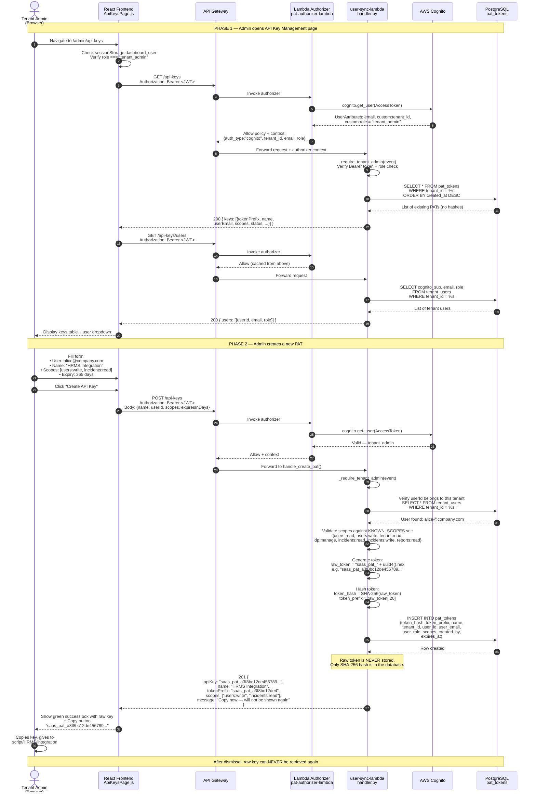
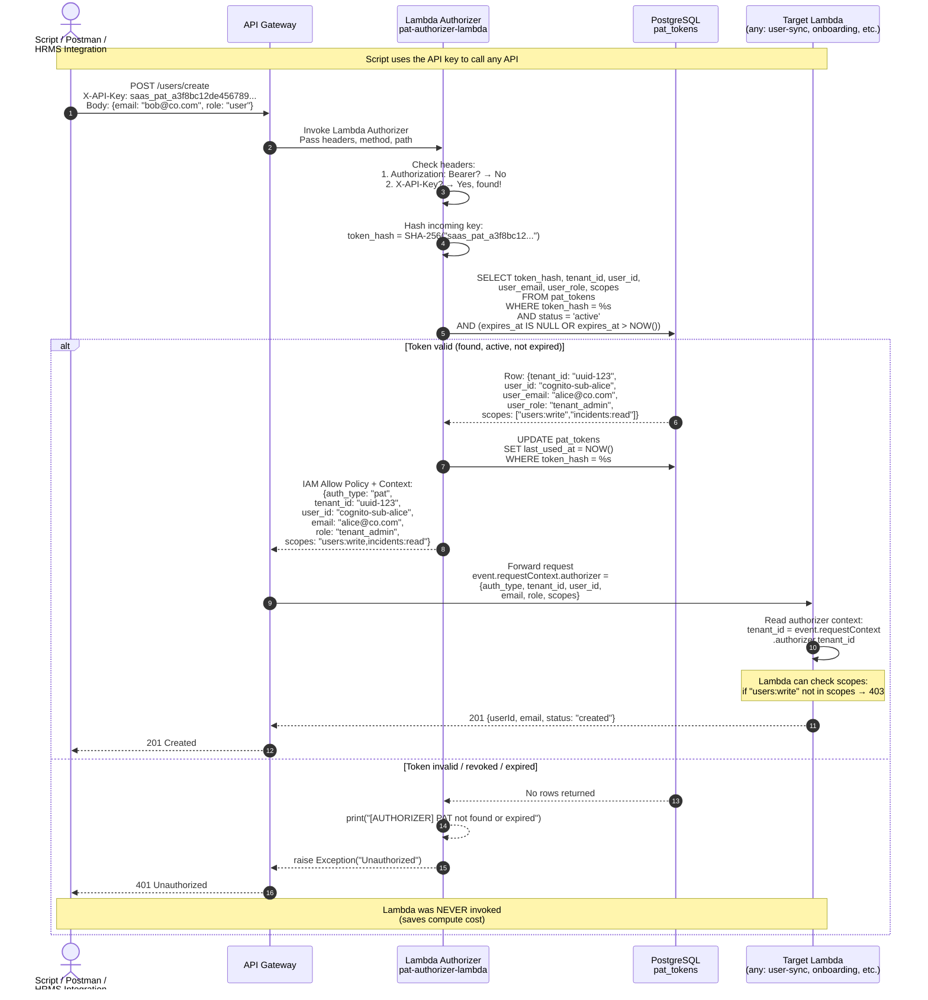
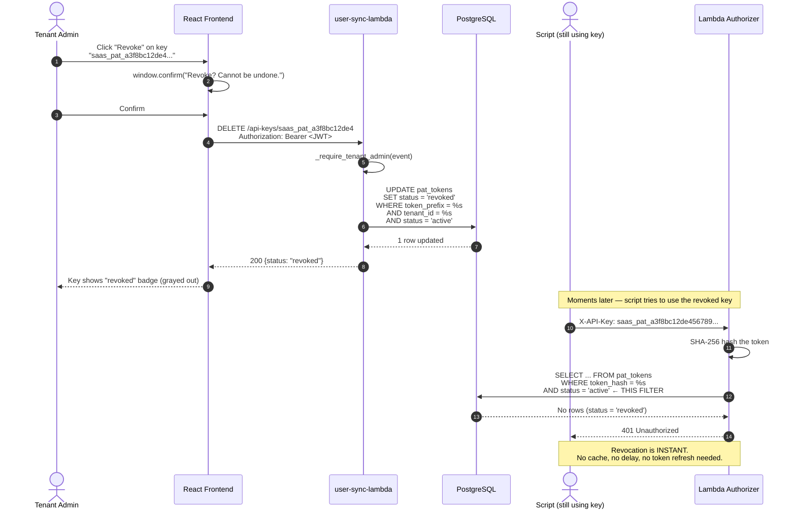
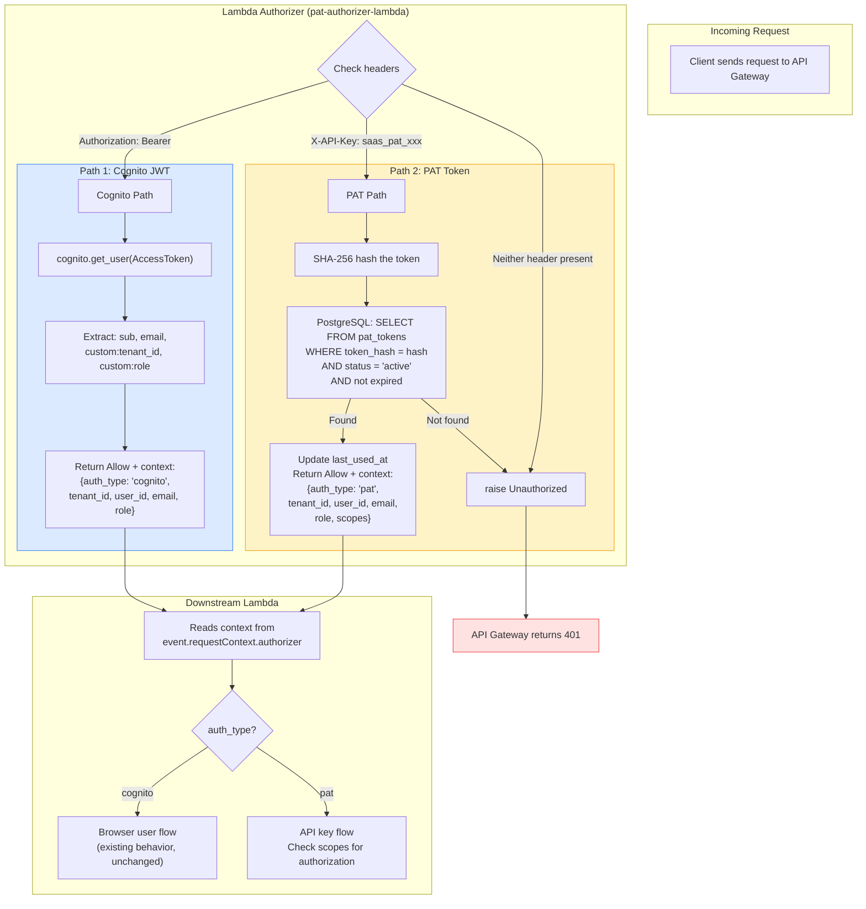

# API Key (PAT) Authentication — End-to-End Flow

## Diagram 1: PAT Creation (Admin creates API key)

## Diagram 2: PAT Usage (Script/Postman hits API)

## Diagram 3: PAT Revocation (Instant kill)

## Diagram 4: Dual Auth — How both paths coexist

