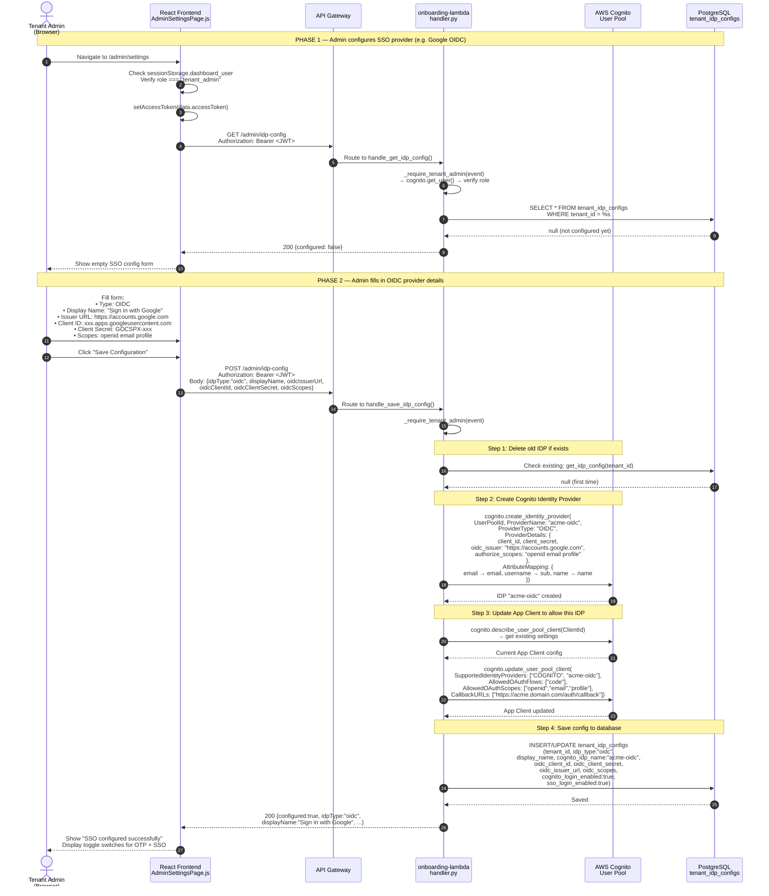
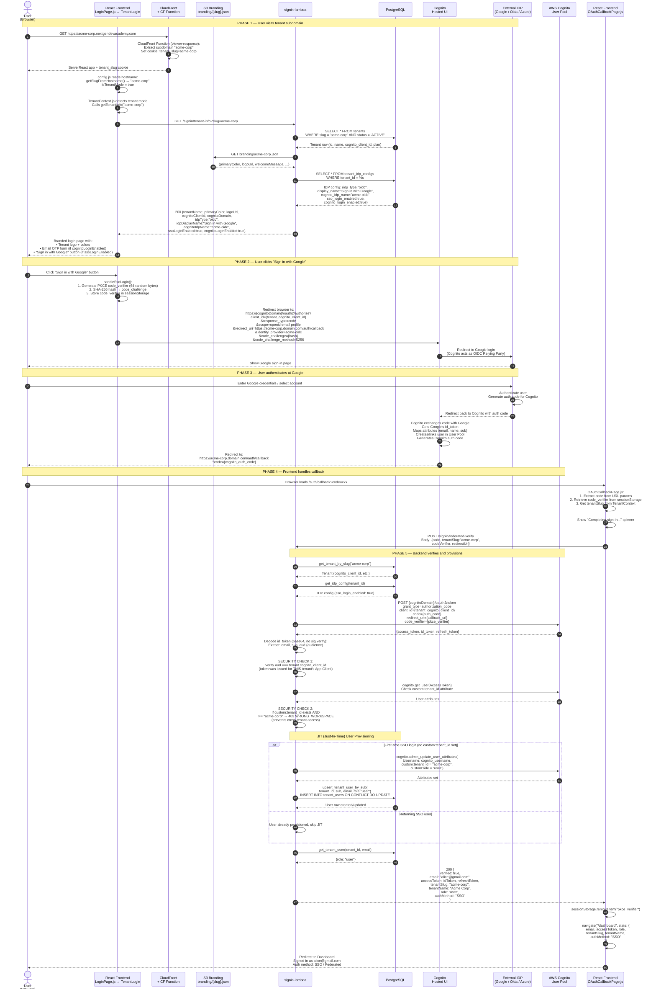
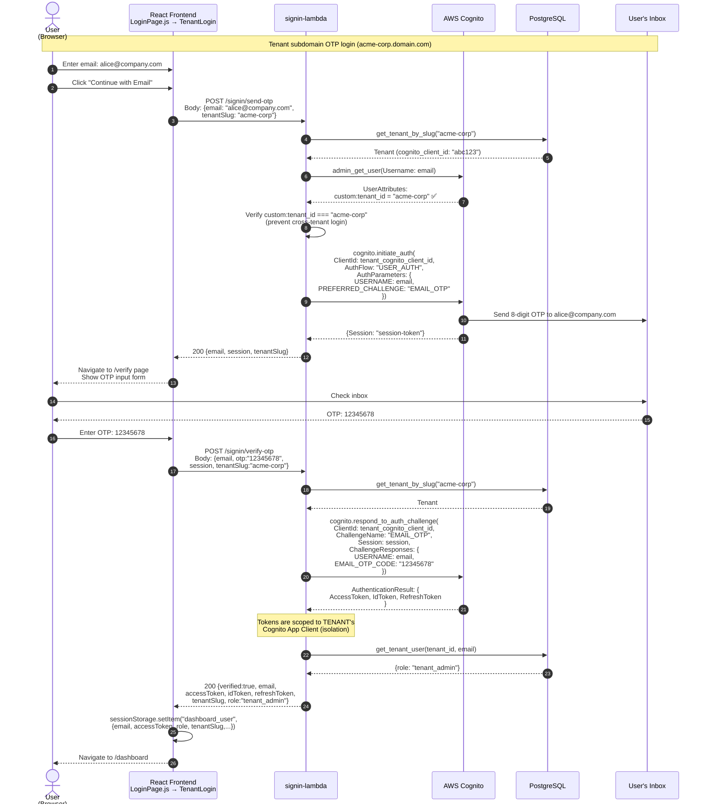
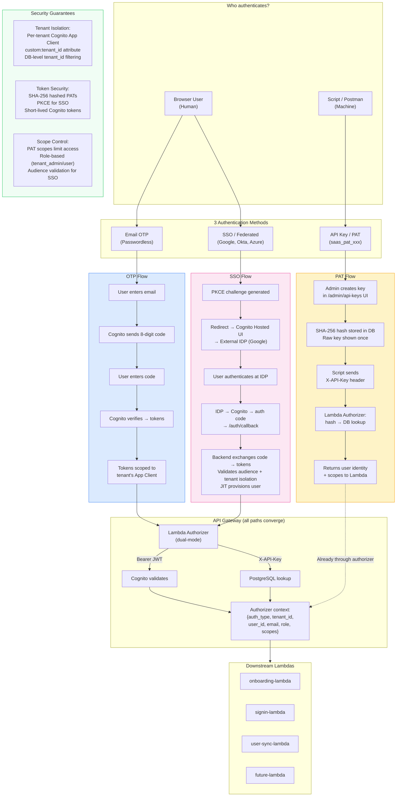

# SSO & Federated Authentication — End-to-End Flow

## Diagram 1: SSO Configuration (Admin sets up OIDC/SAML)

## Diagram 2: SSO/Federated Login (User signs in via Google/Okta)

## Diagram 3: OTP Login (Passwordless email — for comparison)

## Diagram 4: Complete Authentication Architecture Overview

